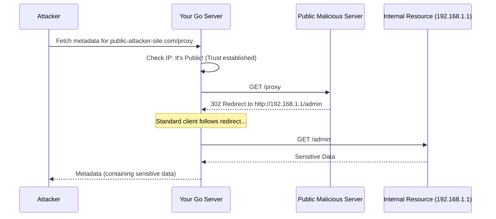

# The Ghost in the Machine: Defeating Redirect SSRF in Go

In the world of web security, we often talk about Server-Side Request Forgery (SSRF) as a direct attack: an attacker tells a server to fetch `http://localhost:8080`, and the server blindly obeys. Most developers now know to check the initial URL to ensure it doesn't point to a private IP.

But there is a more subtle, "ghostly" version of this attack that relies on the way HTTP clients handle redirects. It’s a fascinating look at how trust can be exploited across different layers of the network stack, and it shows why a simple IP check on the initial URL is rarely enough.

<!-- more -->

---

## The Learning Scenario: The Redirect Trap

In our day to day job as developers, we often deal with external services and APIs where we need to fetch data from a given URL. This could be to get some information about a user, a product, or anything else or in case of a webhook, we might need to send some data to a given URL. The common pattern we follow is: resolve the DNS, check if the IP is private, and if not, go ahead and fetch.

The "Liar's Move" exploited by attackers works like this:

1.  An attacker provides a URL to a public server they control: `https://public-attacker-site.com/proxy`.
2.  Your server checks the IP. It’s public. Check passed.
3.  Your server makes the request.
4.  The attacker’s server responds with an HTTP 302 Found and a header: `Location: http://192.168.1.1/admin`.
5.  Your standard HTTP client follows that redirect automatically.
6.  Because the safety check only happened on the first URL, the client is redirected into your internal network.

### Visualizing the Attack



---

## Reproducing the Exploit

To understand this, let's write a Go test that simulates an attacker. We set up two servers: an "internal" server with confidential data, and a "malicious" server that redirects our client into it.

### The Vulnerable Code

```go
func FetchMetadata(client *http.Client, url string) (*http.Response, error) {
    return client.Get(url)
}
```

### The Test Case

```go
func TestVulnerableClient(t *testing.T) {
    // 1. An internal server with confidential data
    internalServer := httptest.NewServer(http.HandlerFunc(func(w http.ResponseWriter, r *http.Request) {
        fmt.Fprintln(w, "CONFIDENTIAL DATA")
    }))
    defer internalServer.Close()

    // 2. A malicious server that redirects to the internal server
    maliciousServer := httptest.NewServer(http.HandlerFunc(func(w http.ResponseWriter, r *http.Request) {
        http.Redirect(w, r, internalServer.URL, http.StatusFound)
    }))
    defer maliciousServer.Close()

    // 3. A vulnerable client follows the redirect blindly
    resp, err := FetchMetadata(&http.Client{}, maliciousServer.URL)
    if err == nil {
        fmt.Printf("Vulnerability Confirmed: Client reached %s\n", resp.Request.URL)
    }
}
```

---

## L7 Mitigation: Redirect Validation via CheckRedirect

The first fix is to teach our `http.Client` to be skeptical of redirects. We use the [`CheckRedirect`](https://pkg.go.dev/net/http#Client) hook. This function runs before every hop. If the next destination is private, we kill the request.

> In a microservices architecture, any service that accepts user provided webhook receivers, link preview generators, callback handlers, etc. are potential SSRF surfaces. At scale, you can't rely on every team writing their own validation. The answer is a hardened HTTP client that lives in a shared library(client library good but not always, will discuss this in some other post).

```go
func NewSecureClient() *http.Client {
    return &http.Client{
        CheckRedirect: func(req *http.Request, via []*http.Request) error {
            if len(via) >= 10 {
                // by default http client follows 10 redirects, we can limit it to prevent infinite loops
                return errors.New("stopped after 10 redirects")
            }

            host := req.URL.Hostname()
            ips, err := net.LookupIP(host)
            if err != nil {
                return fmt.Errorf("security block: could not lookup IP for %s", host)
            }

            for _, ip := range ips {
                if ip.IsPrivate() || ip.IsLoopback() ||
                    ip.IsLinkLocalUnicast() || ip.IsLinkLocalMulticast() ||
                    ip.IsUnspecified() {
                    return fmt.Errorf("security block: redirect to private IP %s", ip)
                }
            }
            return nil
        },
    }
}
```

`CheckRedirect` is our first line of defense at the application logic layer (L7). It prevents the client from blindly following a trail that leads into your private VPC.

> `CheckRedirect` adds a small overhead per connection. In latency-sensitive paths, you may want to benchmark this.

---

## L4 Mitigation: Closing the DNS Rebinding Window

Wait! There is still a catch. What if an attacker uses **DNS Rebinding**?

This is a classic **Time-of-Check to Time-of-Use (TOCTOU)** vulnerability. The attacker makes a domain resolve to a public IP for your `CheckRedirect` logic (Time-of-Check). Then, they quickly swaps to point to a private IP (like `127.0.0.1`) right as the HTTP client tries to establish the actual TCP connection (Time-of-Use).

To prevent this, we add a check at the **Network Layer (L4)**. By using the `Control` function in a `net.Dialer`, we can inspect the IP address at the exact moment the socket is being created, but before the connection is established. This is our "physical" barrier.

```go
func HardenedTransport() *http.Transport {
    return &http.Transport{
        DialContext: (&net.Dialer{
            // Control is the "last mile" check. It's called after the IP is resolved
            // but before the connection is actually made.
            Control: func(network, address string, c syscall.RawConn) error {
                host, _, err := net.SplitHostPort(address)
                if err != nil {
                    return err
                }
                ip := net.ParseIP(host)
                if ip != nil && (ip.IsPrivate() || ip.IsLoopback() ||
                    ip.IsLinkLocalUnicast() || ip.IsLinkLocalMulticast() ||
                    ip.IsUnspecified()) {
                    return errors.New("L4 Block: Private IP detected at connection time")
                }
                return nil
            },
        }).DialContext,
    }
}
```

> It's worth noting that cloud metadata endpoints (like AWS/GCP's 169.254.169.254) need explicit blocking. It's worth calling out explicitly.

> This L4 check is the most robust defense because it doesn't care about DNS records or redirect headers. It only cares about the destination IP on the wire.

---

## Validating the Layered Defense

Now, let's combine both L7 and L4 protections into a "Hardened Client" and run our test again.

### The Hardened Client

```go
func HardenedClient() *http.Client {
    client := NewSecureClient() // L7 Protection
    client.Transport = HardenedTransport() // L4 Protection
    return client
}
```

### The Success Test

```go
func TestSecureClient(t *testing.T) {
    // Same setup: internal + malicious servers
    internalServer := httptest.NewServer(http.HandlerFunc(func(w http.ResponseWriter, r *http.Request) {
        fmt.Fprintln(w, "CONFIDENTIAL DATA")
    }))
    defer internalServer.Close()

    maliciousServer := httptest.NewServer(http.HandlerFunc(func(w http.ResponseWriter, r *http.Request) {
        http.Redirect(w, r, internalServer.URL, http.StatusFound)
    }))
    defer maliciousServer.Close()

    client := HardenedClient()
    _, err := FetchMetadata(client, maliciousServer.URL)

    if err != nil {
        fmt.Printf("Success: The hardened client blocked the redirect!\n")
        fmt.Printf("Error: %v\n", err)
    } else {
        t.Error("Failure: The client still followed the redirect.")
    }
}
```

---

## Summary

By using a layered approach to security, we see that SSRF isn't just about the first URL you receive. It’s about every hop the client takes afterward.

*   **CheckRedirect (L7)** stops the logic of following a trail.
*   **Dialer Control (L4)** acts as a physical barrier to the network, preventing DNS rebinding tricks.

When you stack these layers together, your Go applications become significantly more resilient to the "ghosts" in the redirect chain.

## Try it Yourself

You can run the full simulation (both vulnerable and hardened scenarios) directly in the Go Playground:

👉 **[Go Playground - Redirect SSRF Lab](https://go.dev/play/p/GaPS6kqDu_e)**

---

*Views are my own. Security is a moving target. Always stay curious and skeptical.*

*If you're interested in learning more about Kubernetes security, check out my other [posts](metrics-tls-kustomize.md) on the topic.*
