# Adding Metrics & TLS to a Kubernetes Controller - The Kustomize Way

I recently worked on adding metrics and TLS support to the [Node Readiness Controller](https://github.com/kubernetes-sigs/node-readiness-controller), a kubernetes-sigs project I contribute to. What I thought would be a straightforward config change turned into a rabbit hole of Kustomize components, cert-manager wiring, and Makefile gymnastics. Here's what happened.

<!-- more -->

---

## Some context

If you haven't heard of it, Node Readiness Controller is a Kubernetes controller that manages node taints based on readiness rules. The simplest way to think about it:

> You have a node that isn't ready to accept traffic. You want workloads to land on it only when certain node conditions are met. This controller lets you define those rules.

The project has a [documentation site](https://node-readiness-controller.netlify.app/) with examples if you want to try it out.

After the first release, it was pretty bare bones. Then the questions started showing up: "Can I scrape Prometheus metrics from this?" and "Is the traffic secured with TLS?"

The Kubernetes ecosystem has great support for all of this, and since the project uses kubebuilder, I figured it would be [straightforward](https://book.kubebuilder.io/reference/metrics) which it was in terms of boilerplate setup (everything we needed is part of the kubebuilder setup; we just need to follow the [book](https://book.kubebuilder.io/). Spoiler: it wasn't as simple as I expected. This post is about the config changes I had to make to get everything working.

**Fair warning:** This was my first time setting up metrics and TLS for a controller from scratch. I'm not claiming this is the best way to do it; it's what I figured out by reading docs, trying things, and breaking stuff. If you know better approaches, I'm all ears. PRs, issues, DMs, whatever works 🙏

---

## What I was trying to achieve

I needed to support these deployment profiles from a single codebase:

| Profile | Metrics | TLS | Webhook |
| --- | --- | --- | --- |
| **Bare-bones** | ❌ | ❌ | ❌ |
| **Metrics (HTTP)** | ✅ `:8080` | ❌ | ❌ |
| **Metrics + TLS** | ✅ `:8443` | ✅ cert-manager | ❌ |

One hard rule: **the source** `config/` directory should never be mutated at build time. Everything had to be additive and reversible. And of course, unlike Helm, you can't do `if ... else ...` in Kustomize (which turned out to be one of the biggest headaches).

---

## Kustomize Components to the rescue

I landed on [Kustomize Components](https://kubectl.docs.kubernetes.io/guides/config_management/components/) (`kind: Component`) which is used by a lot of projects in the ecosystem. Unlike [overlays](https://kubernetes.io/docs/tasks/manage-kubernetes-objects/kustomization/#bases-and-overlays) that produce standalone variants, components get applied *into* whichever base includes them. Each feature became its own self-contained component:

```plaintext
config/
├── default/              # Base: namespace, prefix, RBAC, manager
│   └── kustomization.yaml
├── prometheus/           # Component: metrics service (HTTP)
│   ├── kustomization.yaml
│   ├── metrics_service.yaml
│   ├── manager_prometheus_metrics.yaml
│   └── tls/              # Sub-component: upgrade to HTTPS
│       ├── kustomization.yaml
│       ├── certificate.yaml
│       ├── cert_metrics_manager_patch.yaml
│       ├── manager_prometheus_metrics_tls.yaml
│       └── metrics_service_tls_patch.yaml
├── certmanager/          # Component: self-signed Issuer
│   ├── kustomization.yaml
│   ├── certificate.yaml
│   └── kustomizeconfig.yaml
└── webhook/              # Component: ValidatingWebhookConfiguration
    ├── kustomization.yaml
    ├── manifests.yaml
    ├── service.yaml
    ├── certificate.yaml
    ├── webhook_patch.yaml
    ├── manager_webhook_patch.yaml
    └── kustomizeconfig.yaml
```

Notice how HTTP and HTTPS metrics have their own directories under `prometheus/`. That's because the [patches](https://kubernetes.io/docs/tasks/manage-kubernetes-objects/kustomization/#customizing) for the manager deployment are different. HTTP just sets `--metrics-bind-address=:8080`, while HTTPS needs the TLS flags, cert volume mounts, and a different port. We were also adding a ServiceMonitor as part of the HTTPS config at one point, but that got removed later (story for another blog maybe).

> It's fun, you get everything in the Kubernetes docs 😄

---

## The build pipeline: feature flags + Makefile

To add components to a base you normally run `kustomize edit add component <path>`, but that modifies the kustomization file in place. Since I didn't want to touch the source tree, I went with a temporary build directory approach.

### Copy, patch, build, clean up

```makefile
BUILD_DIR := $(ROOT_DIR)/bin/build

build-manifests-temp: manifests $(KUSTOMIZE)
    @mkdir -p $(BUILD_DIR)
    @rm -rf $(BUILD_DIR)/config
    @cp -r config $(BUILD_DIR)/
    # ... conditionally add components ...
    @$(KUSTOMIZE) build $(BUILD_DIR)/config/default > $(BUILD_DIR)/manifests.yaml
    @rm -rf $(BUILD_DIR)/config
```

Copy `config/` to a temp dir, run `kustomize edit` there, build, and throw it away. The source stays clean.

### Three flags control everything

```makefile
ENABLE_METRICS ?= false
ENABLE_TLS     ?= false
ENABLE_WEBHOOK ?= false
```

The Makefile uses shell `if` blocks to compose the right set of components:

```makefile
# TLS: Add certmanager component for certificates
@if [ "$(ENABLE_TLS)" = "true" ]; then \
    cd $(BUILD_DIR)/config/default && $(KUSTOMIZE) edit add component ../certmanager; \
fi

# Webhook: Requires TLS for certificates
@if [ "$(ENABLE_WEBHOOK)" = "true" ]; then \
    if [ "$(ENABLE_TLS)" != "true" ]; then \
        echo "ERROR: ENABLE_WEBHOOK=true requires ENABLE_TLS=true"; exit 1; \
    fi; \
    cd $(BUILD_DIR)/config/default && $(KUSTOMIZE) edit add component ../webhook; \
fi

# Metrics: Add prometheus, with TLS config if enabled
@if [ "$(ENABLE_METRICS)" = "true" ]; then \
    cd $(BUILD_DIR)/config/default && $(KUSTOMIZE) edit add component ../prometheus; \
    if [ "$(ENABLE_TLS)" = "true" ]; then \
        cd $(BUILD_DIR)/config/default && \
            $(KUSTOMIZE) edit add component ../prometheus/tls; \
    else \
        cd $(BUILD_DIR)/config/prometheus && \
            $(KUSTOMIZE) edit add patch --path manager_prometheus_metrics.yaml \
            --kind Deployment --name controller-manager; \
    fi; \
fi
```

Webhooks require TLS, so you get a clear error if you forget. Is this the best approach? Probably not. But it works, and I'm happy to change it if someone has a cleaner idea.

There are convenience targets too so you don't have to remember the flags:

```makefile
deploy-with-metrics:             ENABLE_METRICS=true
deploy-with-metrics-and-tls:     ENABLE_METRICS=true ENABLE_TLS=true
deploy-with-webhook:             ENABLE_TLS=true ENABLE_WEBHOOK=true
```

One `make deploy-with-webhook` and the whole stack comes up.

---

## How the TLS part works

Here's the end-to-end flow when metrics are served over HTTPS:

```mermaid
sequenceDiagram
    participant CM as cert-manager
    participant K8s as Kubernetes
    participant Pod as Controller Pod
    participant Prom as Prometheus
    CM->>K8s: Create self-signed Issuer
    CM->>K8s: Issue Certificate → Secret (metrics-server-cert)
    K8s->>Pod: Mount secret as volume at /tmp/k8s-metrics-server/metrics-certs
    Pod->>Pod: Start with --metrics-bind-address=:8443 --metrics-secure --metrics-cert-dir=...
    Prom->>Pod: Scrape https://:8443/metrics
```



On the Go side, controller-runtime made this surprisingly easy. Three flags is all it takes:

```go
flag.StringVar(&metricsAddr, "metrics-bind-address", "0", "...")
flag.BoolVar(&metricsSecure, "metrics-secure", false, "...")
flag.StringVar(&metricsCertDir, "metrics-cert-dir", "", "...")

metricsServerOptions := metricsserver.Options{
    BindAddress:   metricsAddr,
    CertDir:       metricsCertDir,
    SecureServing: metricsSecure,
    FilterProvider: func() ... {
        if metricsSecure {
            return filters.WithAuthenticationAndAuthorization
        }
        return nil
    }(),
}
```

When `--metrics-secure` set, the metrics server serves over HTTPS and enforces Kubernetes auth on every scrape request via the filter provider. The `WithAuthenticationAndAuthorization` filter only kicks in when TLS is on; you can read more about it in the [controller-runtime docs](https://pkg.go.dev/sigs.k8s.io/controller-runtime@v0.18.4/pkg/metrics/filters#WithAuthenticationAndAuthorization).

We missed the actual metrics code here too; it's simple but important and you can read it [here](https://github.com/kubernetes-sigs/node-readiness-controller/blob/main/internal/metrics/metrics.go)

---

## Things that broke along the way 🐛

### Port number confusion

Two modes mean two ports:

* **HTTP** → `:8080`
    
* **HTTPS** → `:8443`
    

The default `metrics-bind-address` is `"0"` disabled. I needed the Kustomize patches to set the right port depending on TLS. Ended up with two separate patches:

* `manager_prometheus_metrics.yaml` → sets `--metrics-bind-address=:8080`
    
* `manager_prometheus_metrics_tls.yaml` → sets `--metrics-bind-address=:8443` plus `--metrics-secure` and `--metrics-cert-dir`
    

The service also needed patching. The TLS patch deletes the HTTP port and adds HTTPS:

```yaml
spec:
  ports:
  - name: http
    $patch: delete
  - name: https
    port: 8443
    targetPort: 8443
```

Straightforward once you figure it out, but I definitely stared at this for a while before it clicked.

### Make's "Entering directory" messages breaking kubectl

This one was fun. During e2e tests, the output of `make build-manifests-temp` gets piped into `kubectl apply`. It turns out Make prints `make: Entering directory '...'` when you use `--directory`, and kubectl tries to parse that as YAML. Obviously it fails.

The fix was simple: prefix recipe lines with `@` to suppress echoing, and use `--no-print-directory` for sub-makes. But finding *why* `kubectl apply` was choking took longer than I'd like to admit.

### The certificate worked for Prometheus but didn't for webhooks??

While this was not part of this initial effort, later when I was setting up webhooks, something went wrong. This was the error:

> Error from server (InternalError): error when creating "config/samples/duplicate_taint.yaml": Internal error occurred: failed calling webhook "vnodereadinessrule.kb.io": failed to call webhook: Post "https://nrr-webhook-service.nrr-system.svc:443/validate-readiness-node-x-k8s-io-v1alpha1-nodereadinessrule?timeout=10s": tls: failed to verify certificate: x509: certificate is valid for webhook-service.system.svc, webhook-service.system.svc.cluster.local, not nrr-webhook-service.nrr-system.svc

We moved to using it `replacement` to populate the `dnsName` field of the certificates, and it turned out the replacement was not appending the `nrr-` prefix if the certificate was not part of the base dir. Having the certificate in the base dir added a dependency for certificates of both webhook and metrics to be present, which is not the case every time. Hence, we moved to the classic hardcoding approach.

> Not a supporter of this for sure, but hey, it works if you hardcode things for a specific component.

---

## What I'd do differently

1. **Validate kustomize build output in CI earlier.** I added `kustomize build` checks late. A CI step that builds all four profiles and validates the YAML would have caught issues much faster.
    
2. **Helm might be better for complex composition.** Kustomize Components worked for 3 toggleable features. If I had 10+, I'd probably reach for Helm's templating. There's actually an [issue](https://github.com/kubernetes-sigs/node-readiness-controller/issues/26) open to add Helm support to the project.
    

---

## Takeaways

* **Kustomize Components are underrated.** They're basically feature flags for YAML. Great for optional stuff that layers on top of a base.
    
* **Don't mutate source config at build time.** Copy to temp, patch there, build, clean up. Keeps your git history sane.
    
* **controller-runtime makes the Go side of TLS easy.** Point it at a cert directory, set `SecureServing: true`, done. The hard part is getting the certs to the right place via Kustomize and cert-manager.
    

---

## The PR that started all of this

Honestly, one of the most fun parts was the PR discussion. What started as "just add metrics support" turned into a deep conversation about Kustomize architecture, TLS best practices, cert-manager edge cases, and Makefile ergonomics. If you enjoy watching how things get built in open source, the full discussion is here: [PR #79 — Enable metrics manifests](https://github.com/kubernetes-sigs/node-readiness-controller/pull/79).

A lot of the patterns I described in this post came directly from reviewer feedback on that PR. Open source at its best.

---

## Give it a spin

```bash
# Basic deploy (no metrics, no TLS)
make deploy

# Metrics over HTTP
make deploy-with-metrics

# Metrics over HTTPS + cert-manager
make deploy-with-metrics-and-tls
```

> Requires some pre-installed CRDs for now!

The source is at [kubernetes-sigs/node-readiness-controller](https://github.com/kubernetes-sigs/node-readiness-controller). Like I said, this was a first for me, and I'm sure there's room to do things better. If you've done something similar or have ideas, I'd love to hear about it.

---

*Views are my own. Shaped by a lot of trial, error, and some really helpful code reviews. Shoutout to the amazing maintainers*